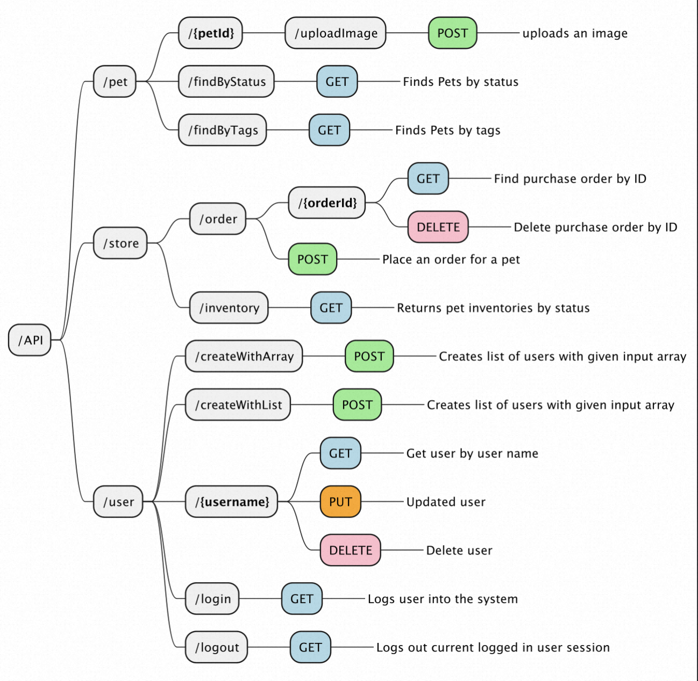

# APIMind

[![NPM version][npm-image]][npm-url]
[![Downloads][downloads-image]][downloads-url]
[![MIT License][license-image]][license-url]

Use OpenAPI(swagger) file generate plantuml mindmap.

`apimind --url https://petstore.swagger.io/v2/swagger.json -o test.puml`

<p align="center">
    
</p>


## Install

For use in command line, install globally:

```bash
$ npm install apimind -g
```

## Usage

### Command Line

```bash
$ apimind -h
  Usage: apimind [options]
  
  Generate PlantUML from OpenAPI
  
  Options:
    -V, --version        output the version number
    --url <url>          remote url
    -i, --input <file>   input file (*.yaml, *.json)
    -o, --output <name>  output file (*.puml)
    -h, --help           display help for command
```

## Development

Clone this repository locally :

```bash
$ git clone https://github.com/hsuanxyz/apimind.git
```

Install dependencies with npm:

```bash
$ npm install
```

### Build

```bash
$ npm run build
```

## LICENSE

MIT

[npm-url]: https://www.npmjs.com/package/apimind
[npm-image]: https://img.shields.io/npm/v/apimind.svg
[downloads-image]: https://img.shields.io/npm/dm/apimind.svg
[downloads-url]: http://badge.fury.io/js/apimind
[license-image]: http://img.shields.io/badge/license-MIT-blue.svg?style=flat
[license-url]: LICENSE
